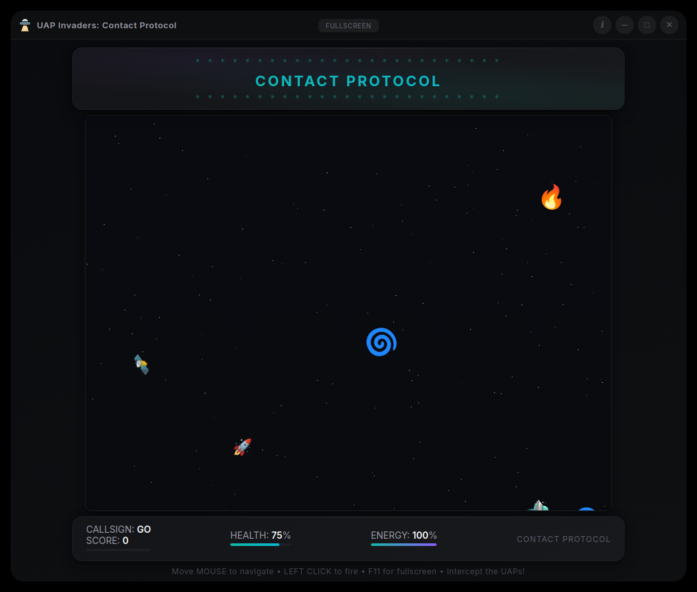

# UAP Invaders: Contact Protocol

> A modern Space Invaders game featuring UAP-themed enemies, mouse controls, and a Dark Neo Glass UI


[](https://opensource.org/licenses/MIT)
[](https://www.electronjs.org/)
[](https://nodejs.org/)
[](https://github.com/sanchez314c/uap-invaders/releases)

<p align="center">
  
</p>

UAP Invaders is a modern take on the classic Space Invaders arcade game with authentic UAP (Unidentified Aerial Phenomena) enemies. Built with Electron, it runs natively on macOS, Windows, and Linux. Defend Earth from 6 unique UAP types (including the famous Tic Tac), using smooth mouse controls and a regenerating energy system.

## Features

- 6 unique UAP types based on real documented encounters: Saucer, Probe, Tic Tac, Phoenix Light, Orb, and Vortex
- Mouse-driven controls: move to aim, left-click to fire
- Energy system that regenerates over time, adding a tactical resource layer
- Progressive difficulty that scales spawn rates with your score
- Custom pilot callsign and local top-10 leaderboard, persisted between sessions
- Frameless transparent window with Neo-Noir Glass design and custom IPC window controls
- Cross-platform: macOS (Intel + Apple Silicon), Windows, and Linux

## Quick Start

```bash
git clone https://github.com/sanchez314c/uap-invaders.git
cd uap-invaders
npm install

# Run from source (Linux)
./run-source-linux.sh

# Run from source (macOS)
./run-source-mac.sh

# Or start directly
npm start
```

For full setup instructions see [docs/INSTALLATION.md](docs/INSTALLATION.md). For the fastest path, see [docs/QUICK_START.md](docs/QUICK_START.md).

## Controls

| Action | Input |
|--------|-------|
| Move ship | Mouse movement |
| Fire | Left click |
| Toggle fullscreen | F11 |
| New game | Ctrl/Cmd+N |

## UAP Threat Assessment

| Type | Points | Speed | Based On |
|------|--------|-------|----------|
| Classic Saucer | 10 | 1 | Traditional sightings |
| Probe | 15 | 2 | Reconnaissance craft |
| Tic Tac | 25 | 3 | USS Nimitz encounter |
| Phoenix Light | 30 | 1.5 | Phoenix Lights incident |
| Orb | 20 | 2.5 | Luminous spherical objects |
| Vortex | 40 | 1 | Advanced propulsion craft |

## Building

```bash
# Build for current platform
npm run dist:current

# Build for specific platforms
npm run dist:mac
npm run dist:win
npm run dist:linux

# Build all platforms
npm run dist:maximum
```

Build outputs go to `dist/`. See [docs/BUILD_COMPILE.md](docs/BUILD_COMPILE.md) for full details.

## Project Structure

```
uap-invaders/
├── src/
│   ├── main.js          # Electron main process, window management, IPC handlers
│   ├── preload.js       # contextBridge IPC bridge (minimizeWindow, closeWindow, etc.)
│   └── index.html       # Full game: CSS design tokens, game engine, UI (single file)
├── resources/
│   └── icons/           # .icns, .ico, .png application icons
├── scripts/             # Build and utility shell scripts
├── docs/                # Full documentation (see docs/README.md)
├── .github/             # CI workflow and issue/PR templates
├── archive/             # Timestamped project backups
└── package.json         # Project config and electron-builder settings
```

## Data Persistence

High scores and callsigns are stored in `localStorage` (no backend required). Data location varies by OS:

| OS | Path |
|----|------|
| macOS | `~/Library/Application Support/UAP Invaders Contact Protocol/` |
| Windows | `%APPDATA%/UAP Invaders Contact Protocol/` |
| Linux | `~/.config/UAP Invaders Contact Protocol/` |

## Development

```bash
# Dev mode with DevTools
npm run dev

# Lint
npm run lint

# Format
npm run format
```

See [docs/DEVELOPMENT.md](docs/DEVELOPMENT.md) for full development workflow.

## Contributing

See [CONTRIBUTING.md](CONTRIBUTING.md) for code standards, branching strategy, and PR process. All contributors are expected to follow [CODE_OF_CONDUCT.md](CODE_OF_CONDUCT.md).

## License

MIT License. See [LICENSE](LICENSE) for details.

Copyright (c) 2025 Jason Paul Michaels

---

[Report Issues](https://github.com/sanchez314c/uap-invaders/issues) | [Request Features](https://github.com/sanchez314c/uap-invaders/issues/new?labels=enhancement) | [Releases](https://github.com/sanchez314c/uap-invaders/releases)
